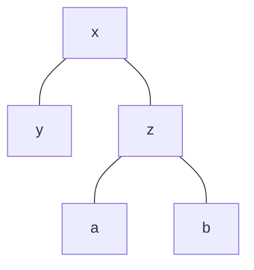

Un [[Arbre binaire]] de tri est un [[Arbre]] construit pour trier des valeurs entrées.

Cette règle de trie doit être définie en avance afin de pouvoir créer cet arbre.
## Exemple

En considérant que tout les [[Arbre#POV Informatique|noeuds]] à gauches sont plus petit que les éléments de droite, cela implique que :
- $y<x<z$
- $x<a<z<b$
