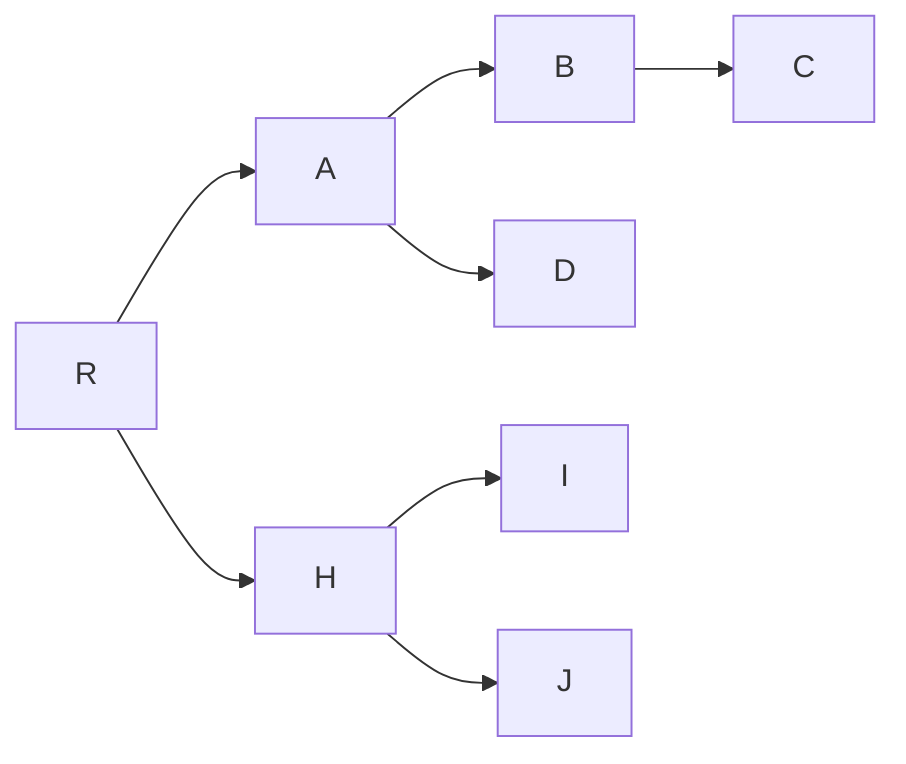

Un [[Arbre]] **binaire** c'est un graphe informatique orienté qui n'a que 2 fils maximums et qu'un parent.

Exemple d'arbre binaire :

L'avantage c'est que l'implémentation avec un langage orienté [[Objet]] avec [[Pointeur|pointeurs]] peu être facilement récursif.

Représentation d'implémentation (réalisé sous paint.net):
![[Arbre binaire schema sous Paint net gaming.png]]
> Cas particulier : [[Arbre binaire de tri]]

## Parcours
Il existe différentes méthodes de parcours/lecture du contenu d'un arbre binaire :
- [[Parcours en profondeur]]
- [[Parcours en largeur]]