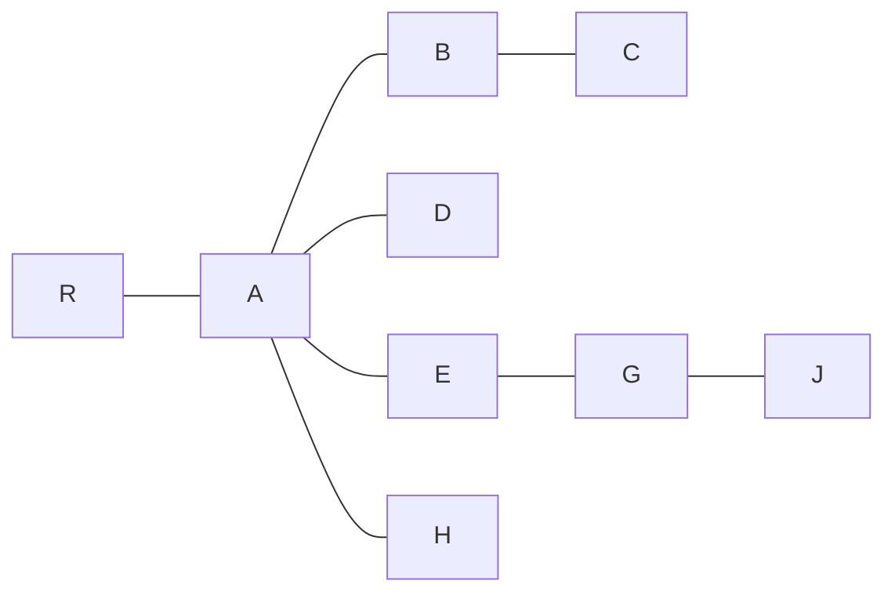

Il existe 2 types d'arbres :
- graphes ([[Mathématiques]])
- implémentation informatique

## POV Graphe mathématique
Un graphe non orienté est :
- Connexe (Il n'y a pas différents morceaux d'arbre)
- Sans cycle (càd qu'on a différent chemins pour aller à un point)

## POV Informatique
> <u>Racine :</u> le point de départ/entrée de l'arbre

Exemple de graphe informatique, avec `R` comme racine :

> <u>Noeud :</u> c'est un en gros des points dans un graphe

Dans cet exemple, le nœud en dessous est le fils du nœud au dessus.
Il y a donc différents niveaux par succession :

| Niveau | Noeuds de l'exemple |
| :-: | :-: |
| 0 | `R` |
| 1 | `A` |
| 2 | `B,D,E,H` |
| 3 | `C,G` |
| 4 | `J`
> <u>Feuille :</u> C'est un nœud qui n'a pas de fils

==Cas particulier :== [[Arbre binaire]]