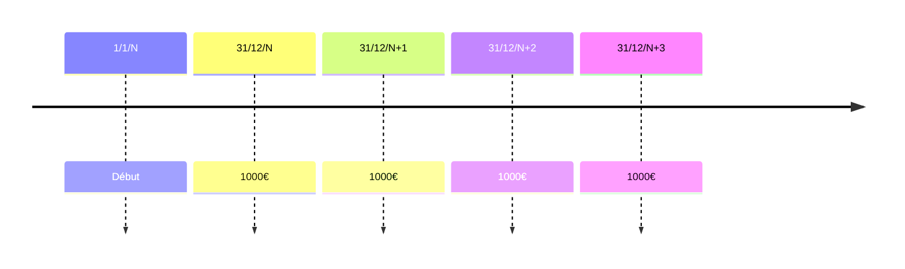

Somme constante placée à intervalles réguliers à intérêts composés.
## Formule
> Versement en fin d'année :

$$V_{n}=a*\frac{(1+i)^{n}}{i}$$
Avec :
- $V$ : le capital
- $n$ : l'année
- $i$ : taux
- $a$ : annuités par année

A savoir que si le versement est en début d'année, la formule donne : $V_{n}=a*\frac{(1+i)^{n}}{i}*(1+i)$
## Exemple de capitalisation
- Schéma :

- Calcul :
	- $V_{n}=1000*\frac{(1.06)^{n}-1}{0.06}$
	- $V_{n}=1000*5.637092$
	- $V_{n}=$ 5637.09€
## Exemple d'actualisation
$V_0$ est la valeur actuel du capital. Formule adaptée à l'actualisation:
$$V_0 = a*\frac{1-(1+i)^{-n}}{i}$$
Contexte de l'exemple :
```
Appartement de 120k€, reste en 7 annuités taux 3%
20k au comptant donc 120k€-20k€=100k€ à répartir sur 7 ans
```
On cherche combien vaut l'annuité aujourd'hui ?
On cherche donc l'annuité $a$ :
- $100000=a*\frac{1-(1+1.03)^{-7}}{0.03}$
- $100000 = a * 6.230282955$
- $a=\frac{100000}{6.230282955}=16050.63$

Pour acheter l'appartement de 120k€, il faut verser une fois 20k€ puis 16050.63€
> Coût réel : $20000+(16050.63*7)=20000+112354.41=132354.41$