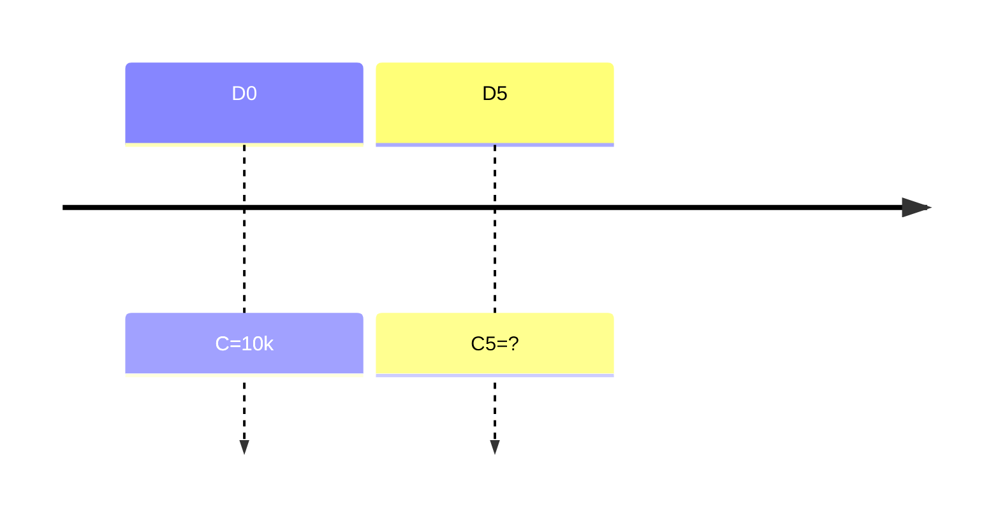
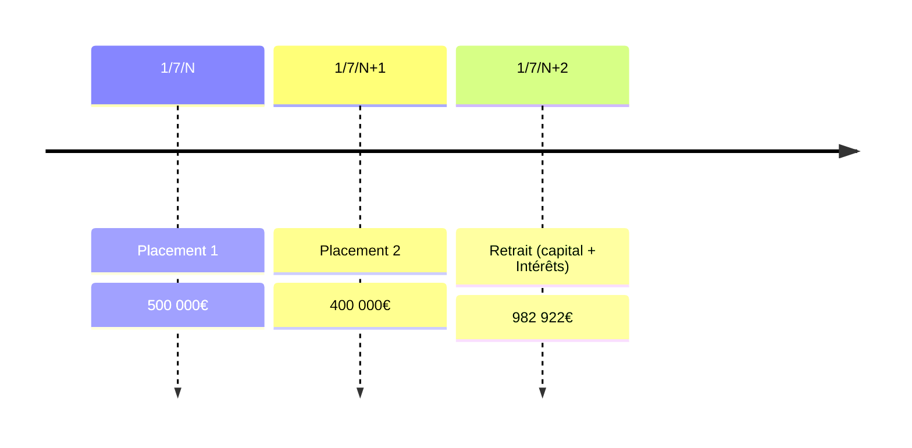

Placements > 1 an
Utilisé aussi pour les emprunts
## Formule
$$C_n=C*(1+i)^n$$
- C : Capital (soit le montant)
- i : taux en %
- n : nb d'années
### Formules dérivées
A savoir que calculer :
- Vers le futur : ==capitalisation==
- Vers le passé : ==actualisation==

Vérifier la capitalisation de départ :
$$C_0=C_n*(1+i)^{-n}$$
Pour retrouver le taux (en %) :
$$i=(\frac{C_n}{C})^{\frac{1}{n}}-1$$
Pour retrouver sur combien d'années ($L_n$ est un $log$ népérien):
$$n = \frac{L_n(\frac{C_n}{C})}{L_n(1+i)}$$
> Ne pas arrondir car il est question de temps
## Autres échelles de temps
Si on a un taux annuel :
- taux mensuel = $(1+tauxannuel)^{1/12}-1$
- taux trimestriel = $(1+tauxannuel)^{1/4}-1$
- taux semestriel = $(1+tauxannuel)^{1/2}-1$
## Exemples
### Résultat après plusieurs années de placement
C = $10000$€
Durée placement : 5 ans
Taux : 3%

Valeur acquise : $C_5=C*(1+i)^n=10000*(1+0.03)^{5}=11592.740743$
#### Vérifications
- Année : $n=\frac{L_n*(11592.74074/10000)}{L_n*1.03}=\frac{0.147794011}{0.029558802}=5ans$
- (flemme de faire les 2 autres)
#### Exemple calcul taux non-annuels
Admettons qu'on a un taux annuel de 12% :
- Mensuel : $1.12^{1/12}-1=0.00948879293$
- Trimestriel : $1.12^{1/4}-1=0.02873734472$
- Semestriel : $1.12^{1/2}-1=0.05830052442$

### Calculer une date de retrait lors d'une somme atteinte
```
Un capital de 200 000 € placé le 1/07/N au taux annuel de 4,75 % donnera une valeur acquise de 246 446,77 € après n années de placement. Recherchez la durée du placement et la date de retrait de la valeur acquise.
```
- Calcul initial : $\frac{ln(\frac{246446.77}{200000})}{ln(1+0.0475)}=4.49999962822$
- Conversion en jours :
	- Extraction de l'année : résultat-4 (ça nous fait 4 ans) : il nous reste $0.49999962822$
	- Extraction du mois : $0.49999962822*12=5.999995433$ ; résultat-5 (car ça nous fait 5 mois) : il nous reste $0.999995433$
	- Extraction des jours : $0.999995433*30=29.99986298$ soit 30 jours
- Calcul de quand retirer : $1/7/N + 4.5 annees = 1/1/N+5$

> Donc il faudra placer le capital sur 4 ans et demi, soit retirer le **premier janvier N+5**


### Calculer le taux après 2 placements

Donc $982922=500000(1+i)^2 + 400000(1+i)$
On admet que $x=1+i$, on a donc :
- $982922=500000x^2 + 400000x$
- $982.922=500x^2 + 400x$ en milliers d'€
- On détermine le déterminant positif de $\Delta = b^2-4ac$ :
	- $500x^2 + 400x-982.922=0$
		- $a=500$
		- $b=400$
		- $c=982.922$
	- $\Delta=\sqrt{400^2-4*500*(-982.922)}=1458.02743458$
	- $x2=\frac{(-b+\Delta)}{2a}=\frac{-400000+1459027.435}{2*500000}=1.058027435$
- Donc $x2=1+i=1.058$ soit $i=0.058$

> Le taux de placement est de 5.8%