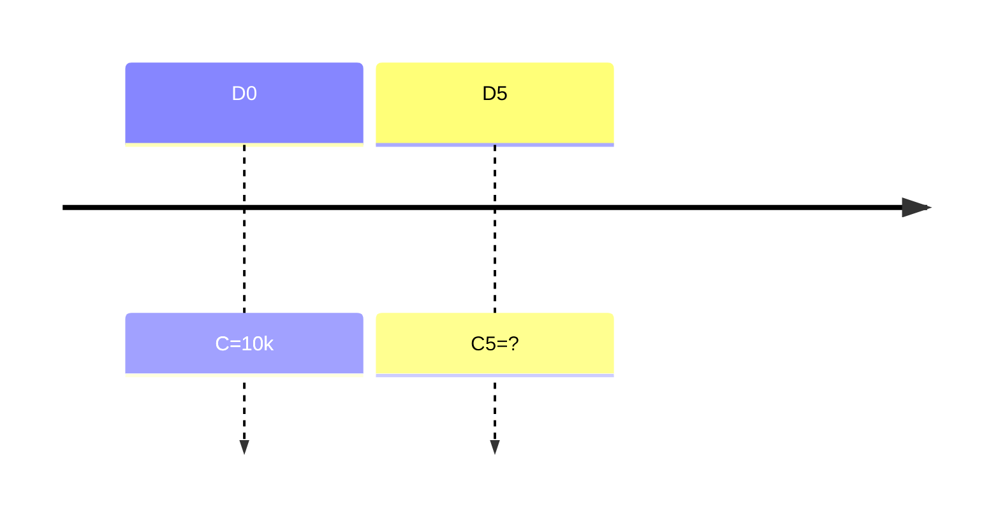

Placements > 1 an
Utilisé aussi pour les emprunts
## Formules
$$C_n=C*(1+i)^n$$
- C : Capital (soit le montant)
- i : taux en %
- n : nb d'années
### Formules dérivées
Vérifier la capitalisation de départ :
$$C_0=C_n*(1+i)^{-n}$$
Pour retrouver le taux (en %) :
$$i=(C_n/C)^{1/n}-1$$
Pour retrouver sur combien d'années ($L_n$ est un $log$ népérien):
$$n = \frac{L_n(C_n/C)}{L_n(1+i)}$$
## Autres échelles de temps
Si on a un taux annuel :
- taux mensuel = $(1+tauxannuel)^{1/12}-1$
- taux trimestriel = $(1+tauxannuel)^{1/4}-1$
- taux semestriel = $(1+tauxannuel)^{1/2}-1$
## Exemples
C = $10000$€
Durée placement : 5 ans
Taux : 3%

Valeur acquise : $C_5=C*(1+i)^n=10000*(1+0.03)^{5}=11592.740743$
### Vérifications
- Année : $n=\frac{L_n*(11592.74074/10000)}{L_n*1.03}=\frac{0.147794011}{0.029558802}=5ans$
- (flemme de faire les 2 autres)
### Exemple calcul taux non-annuels
Admettons qu'on a un taux annuel de 12% :
- Mensuel : $1.12^{1/12}-1=0.00948879293$
- Trimestriel : $1.12^{1/4}-1=0.02873734472$
- Semestriel : $1.12^{1/2}-1=0.05830052442$
