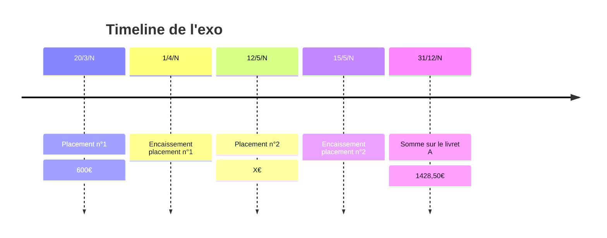

## Formules
Calcul des intérêts simples :
$$I = \frac{C*t*N}{36000}$$
- C : Capital (soit le montant)
- t : taux en %
- n : nb jours

Calcul valeur totale à un temps donné :
$$C_n = C + \frac{C*t*N}{36000}$$
## Autres échelles de temps
Si on a un taux annuel :
- taux mensuel = taux annuel / 12
- taux trimestriel = taux annuel / 4
- taux semestriel = taux annuel / 2
## Exemples
Exercice 7 de l'énoncé

Nombre de jours réels de placement n°1 :
- $(30-20)+(9*30)=10+270=280jours$
- Quinzaines :
	- $9*30=270jours$

Nombre de jours réels de placement n°2 :
- $(30-12)+(7*30)=18 + 210 = 228 jours$
- Quinzaines :
	- $(30-15)+(7*30)=15+210=225jours$

Montant du second versement sachant que les intérêts sont comptés le 1er et le 16 du mois :
- $1428,50 = 600+ \frac{600*3*270}{36000} + X + \frac{X*3*225}{36000}$