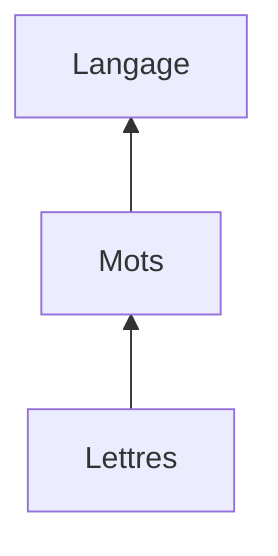

En admettant que $\Sigma$ est un [[Ensembles mathématiques|ensemble]] non vide, ses éléments sont des [[Mots]] (et par extension des [[Lettres]]). Un langage est donc une partie de $\Sigma^{*}$ 
> Exemple : `isn't` est un mot, mais il ne fait pas parti du langage français

La longueur d'un langage aura un nombre de [[Mots]] :
- Maximum $\Sigma^{*}$
	- Ce qu'est $\Sigma^{*}$ : [[Mots|Décomposition de Sigma]]
- Minimum $\emptyset$ (Ensemble vide)
## Représentation des ensembles

Notes additionnelles à ce schéma :

| Nom | Représentation | [[Ensembles mathématiques]] |
| :--: | ---- | ---- |
| Langage | Ensemble de mots | $\subset \Sigma^{*}$ Donc un langage est un sous ensemble de tout les mots pouvant être construits -> Se référer à l'exemple de `isn't` au début de cette note |
| Mots | Séquence de mots | $\Sigma^{*}$ |
| Lettres |  | $\Sigma$ |
> Cette représentation justifie le pourquoi les opérations sur les langages s'appliquent aussi sur les [[Mots]] et [[Lettres]]

## Opérations
On peux effectuer plusieurs opérations [[Mathématiques]] sur un langage :
- [[Addition langage]]
- [[Multiplication langage]]

==Correspondance à noter :==

| Algèbre | Automates |
| :--: | ---- |
| $+0$ | $+\emptyset$ |
| $*0$ | $*\emptyset$ |
| $*1$ | $*\varepsilon$ |
