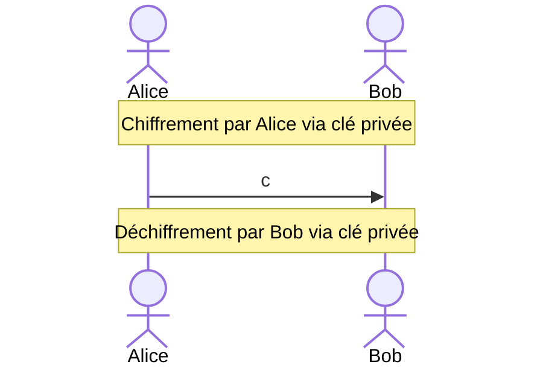

| Avantages | Inconvénients |
| :--: | ---- |
| Très rapide | Comment transmettre la clé sans quelle se fasse interceptée |
## Méthodes de calcul
Il y a différentes méthodes d'application du [[Chiffrement]] symétrique :
- [[Code César]]
- [[Chiffrement affine]]
- [[Chiffrement Vigenère]]
	- [[Chiffrement Vernam]]