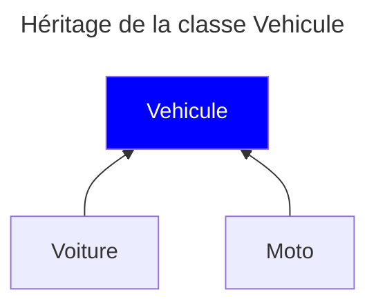

Le principe d'héritage en [[POO]] est le fait qu'il existe des [[Classe|classes]] dérivées (ou filles) d'une [[Classe]] mère.
Exemple :


Une [[Classe]] fille est donc une classe créée sur la base de ce que contient déjà la [[Classe]] mère.
> Dans l'exemple, une `voiture` est avant tout un `véhicule`. `voiture` partage donc les attributs et méthodes de `véhicule`.

Il faut savoir que les méthodes ne seront pas forcément identiques, dû au principe du [[Polymorphisme]].
## Implémentation
L'implémentation de [[Classe]] filles varie énormément en fonction du langage de programmation.
### Héritage en [[Cpp|C++]]
Si l'on se base sur l'exemple des véhicules, admettons qu'une voiture a juste comme nouvel [[Classe#^e5375d|attribut]] un nombre de porte. Son implémentation dans le fichier [[En-tête|.h]] ressemblerait à ça :
```cpp
class Voiture{

}
```