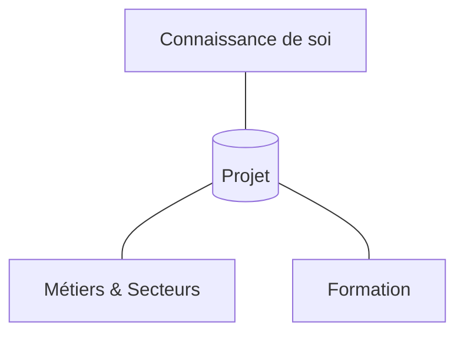

Il est nécessaire de se faire un graphe de projets avant de sélectionner une [[Liste de Métiers]].
Il faut se définir au moins :
- projet principal
- projet alternatif
# Structuration du projet

## Connaissance de soi
Cela comporte :
- Valeurs
- Intérêts
- Compétences
- ?
## Métiers & Secteurs
Cela comporte :
- Missions (en fonction de nos compétences)
- Environnement physique et social
- Lieu
- Conditions
- Débouchés (la demande)
- Conditions de travail (ex: salaire etc)
	- Avantages
	- Inconvénients
- Evolutions du métier :
	- Qualitative
	- Quantitative (variation du nombre de postes)

## Formation
Cela comporte le contenu :
- Contenu donnant des compétences
- Niveau (ex: `Bac+5`)
- Prérequis
- Coûts :
	- Directes (si la formation est payante)
	- Indirectes (ex: logement, transports...)
- Durée
