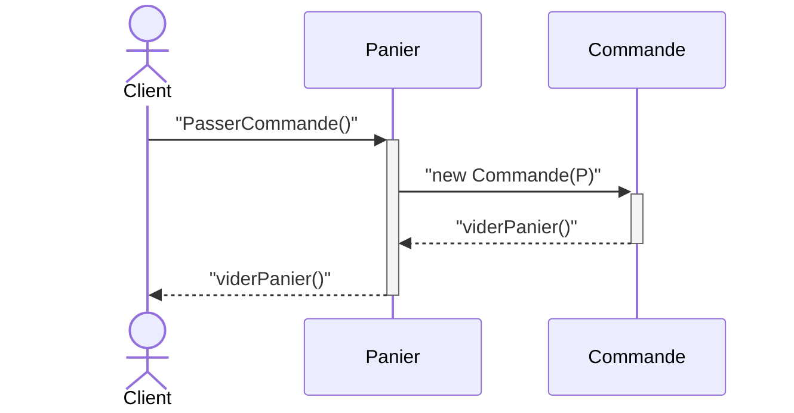

```mermaid
sequenceDiagram
    actor Cl as Client
    participant P as Panier
    Cl->>+P: "PasserCommande()"
    participant Commande
    P->>+Commande: "new Commande(P)"
    Commande-->>-P: "viderPanier()"
    P-->>-Cl: "viderPanier()"

```
