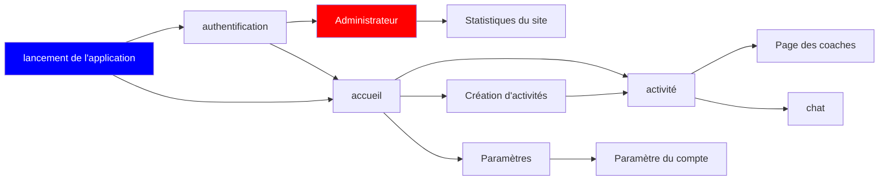

FOULIARD Bryan et CAQUERIOT Gabriel
# Sport ensemble
Ce projet consiste à la réalisation d'une plateforme en ligne entre sportifs. L'objectif est de mettre en contact des sportifs pour exercer leur activité sans être seul
## Notre entreprise

![[Logo.PNG]]
Véritable étoile montante, pas une simple entreprise, dans le secteur de la tech : nous nous considérons comme une véritable révolution en terme de réalisation d'œuvre d'art pour des entreprises tel que Apple, Google, Amazon, ou encore l'éducation régionale de la Lorraine.
## Back-End
### Diagramme Use Case
![[Capture.PNG]]
### Tableau décrivant les fonctionnalités
| Accès sportif | Accès Admin |
| :-: | :-: |
| Echanger avec des sportifs | |
| S'inscrire | Valider l'inscription |
| Consulter activités | Gérer les sportifs |
| Proposer activités | Gérer les coachs |
| Rencontrer sportifs | Visualisation des activités |
| Préparer activités | Accéder aux statistiques |
| Interagir avec les coaches | Interagir avec les coaches |
### Quelques scénarios
#### Scénario 1 : Nominal
Un sportif veux se lancer en temps que coach, et il a déjà des idées d'activités mais n'ayant aucun élève.
#### Scénario 2 : Alternatif
Sportif s'inscrivant pour participer à une activité et rencontrer d'autres sportifs. Il consulte les activités proposées, participe à l'organisation de celles ci, communique avec les autres sportifs.
#### Scénario 3 : Exception
L'administrateur doit s'assurer du bon fonctionnement de la plateforme. Accepte ou refuse des inscriptions. Visualise les activités ainsi qu'un accès aux statistiques.
## Front-End
### Charte graphique
Le bleu (`#202C59`) serait la couleur principal, pour rappeler les couleurs. Une couleur secondaire (`#D95D39`) permettant de faire un contraste sera disponible.
Le logo sera toujours présent sur les pages.
### Diagramme de navigabilité

### Exemples de pages